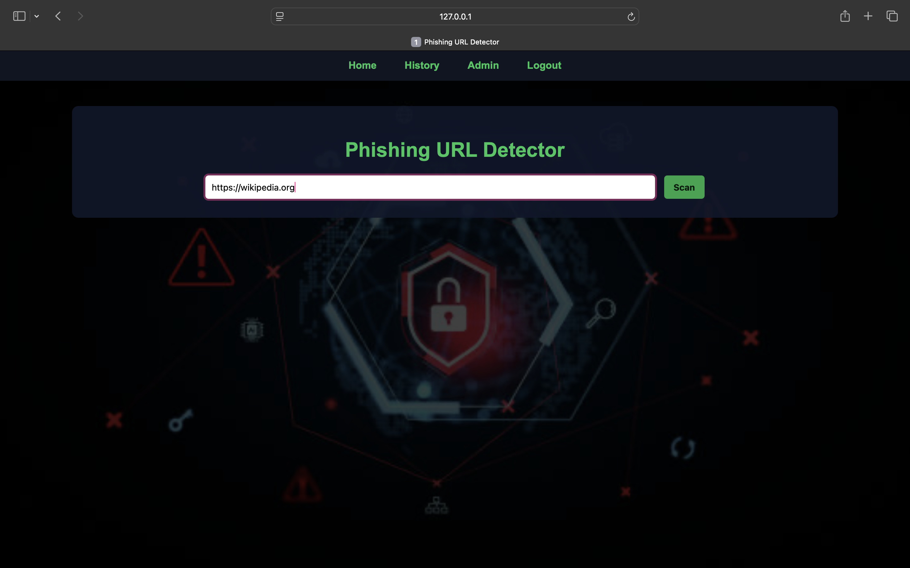
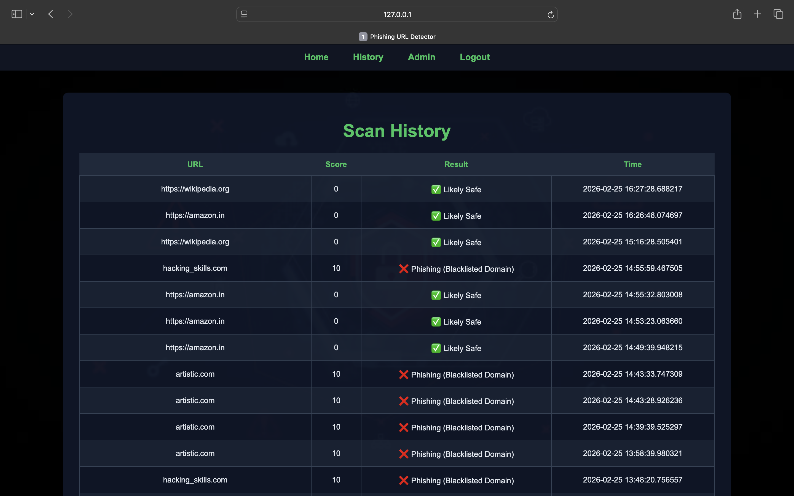
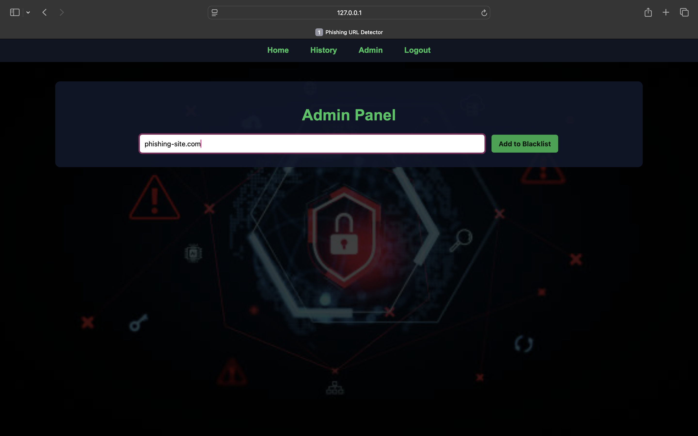

# 🔐 Phishing URL Detector

A web-based phishing detection system built using Flask.

## 🚀 Features
- URL safety checker
- Blacklist system
- Admin panel
- History tracking
- Login system
- Professional security-themed UI

## 🛠️ Tech Stack
- Python
- Flask
- HTML
- CSS
- SQLite

## ▶️ How to Run

1. Clone the repository
2. Create virtual environment
3. Install dependencies
4. Run:

   python app.py

5. Open in browser:
   http://127.0.0.1:5000

## 📸 Screenshots

